# Mobile Robot

Proyecto ROS 2 para un robot móvil en simulación con Gazebo Sim, puente ROS-GZ y soporte para SLAM y localización.

El flujo principal del proyecto está pensado para:

1. Levantar el robot en Gazebo.
2. Conectar los tópicos entre Gazebo y ROS 2.
3. Ejecutar SLAM con `slam_toolbox`.
4. Visualizar el mapa y la navegación en RViz.

## Contenido

- `src/mobile_robot/launch/gazebo_model.launch.py`: lanza la simulación del robot en Gazebo y publica la descripción del robot.
- `src/mobile_robot/launch/slam.launch.py`: arranca Gazebo, el bridge, `slam_toolbox`, el lifecycle manager y RViz.
- `src/mobile_robot/launch/localization.launch.py`: usa un mapa ya creado con `map_server` y localización con AMCL.
- `src/mobile_robot/model/robot.xacro`: modelo del robot con ruedas, base y sensor láser.
- `src/mobile_robot/parameters/slam_params.yaml`: parámetros de SLAM.
- `src/mobile_robot/parameters/bridge_parameters.yaml`: mapeo de tópicos entre ROS 2 y Gazebo.
- `src/mobile_robot/parameters/amcl_params.yaml`: parámetros de localización con AMCL.
- `src/mobile_robot/maps/mi_mapa.yaml`: mapa disponible para localización.


## Requisitos

Antes de ejecutar el proyecto necesitas tener instalado un entorno ROS 2 con estos paquetes:

- `ros_gz`
- `ros_gz_sim`
- `ros_gz_bridge`
- `slam_toolbox`
- `nav2_lifecycle_manager`
- `nav2_map_server`
- `nav2_amcl`
- `robot_state_publisher`
- `joint_state_publisher`
- `xacro`
- `rviz2`

## Instalación 
Para que el sistema de mapeo funcione, es necesario instalar las dependencias de SLAM y comunicación:

```bash
sudo apt update && sudo apt install -y \
  ros-humble-ros-gz \
  ros-humble-slam-toolbox \
  ros-humble-navigation2 \
  ros-humble-nav2-bringup \
  ros-humble-robot-state-publisher \
  ros-humble-joint-state-publisher \
  ros-humble-xacro \
  ros-humble-teleop-twist-keyboard
```

## Compilación

Desde la raíz del workspace (ws_mobile):

```bash
cd ~/ws_mobile
source /opt/ros/jazzy/setup.bash
colcon build --symlink-install
source install/setup.bash
```

## SLAM

El archivo principal para mapeo es `slam.launch.py`. Ese launch hace lo siguiente:

- abre Gazebo con `gazebo_model.launch.py`;
- levanta `ros_gz_bridge` con `parameters/bridge_parameters.yaml`;
- inicia `slam_toolbox` en modo asíncrono con `parameters/slam_params.yaml`;
- activa el lifecycle manager de SLAM;
- intenta abrir RViz con un perfil llamado `rviz/mi_configuracion.rviz`.

Para lanzar SLAM:

```bash
ros2 launch mobile_robot slam.launch.py
```

Al momento de lanzar el Slam con el comando anterior: `ros2 launch mobile_robot slam.launch.py`, Se abrira tanto el gazebo como el Rviz2.

### Parámetros de SLAM

El archivo `src/mobile_robot/parameters/slam_params.yaml` define los elementos clave del mapeo:

- `use_sim_time: True` para sincronizar con el tiempo de simulación;
- `odom_frame: odom` como marco de odometría;
- `map_frame: map` como marco global;
- `base_frame: base_footprint` como base del robot;
- `scan_topic: /scan` como entrada del láser;
- `mode: mapping` para construir el mapa;
- `resolution: 0.05` para la resolución del mapa;
- `max_laser_range: 10.0` para el alcance máximo del láser.

### Bridge de tópicos

El bridge conecta los tópicos principales entre Gazebo y ROS 2:

- `/clock`
- `/cmd_vel`
- `/odom`
- `/tf`
- `/joint_states`
- `/scan`

Esto permite que SLAM reciba odometría, TF y el láser desde la simulación.


## Gazebo
En gazebo, en la parte arriba a la derecha en los tres puntitos  y luego escribimos el `Visualize Lidar` y lo seleccionamos.

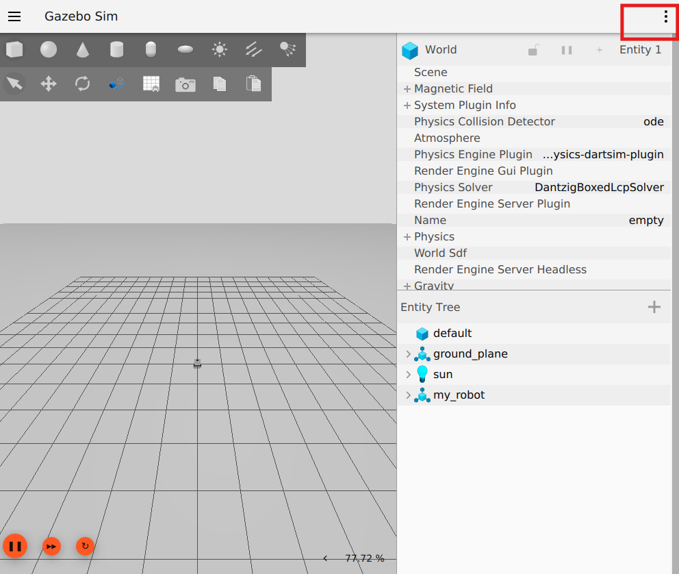

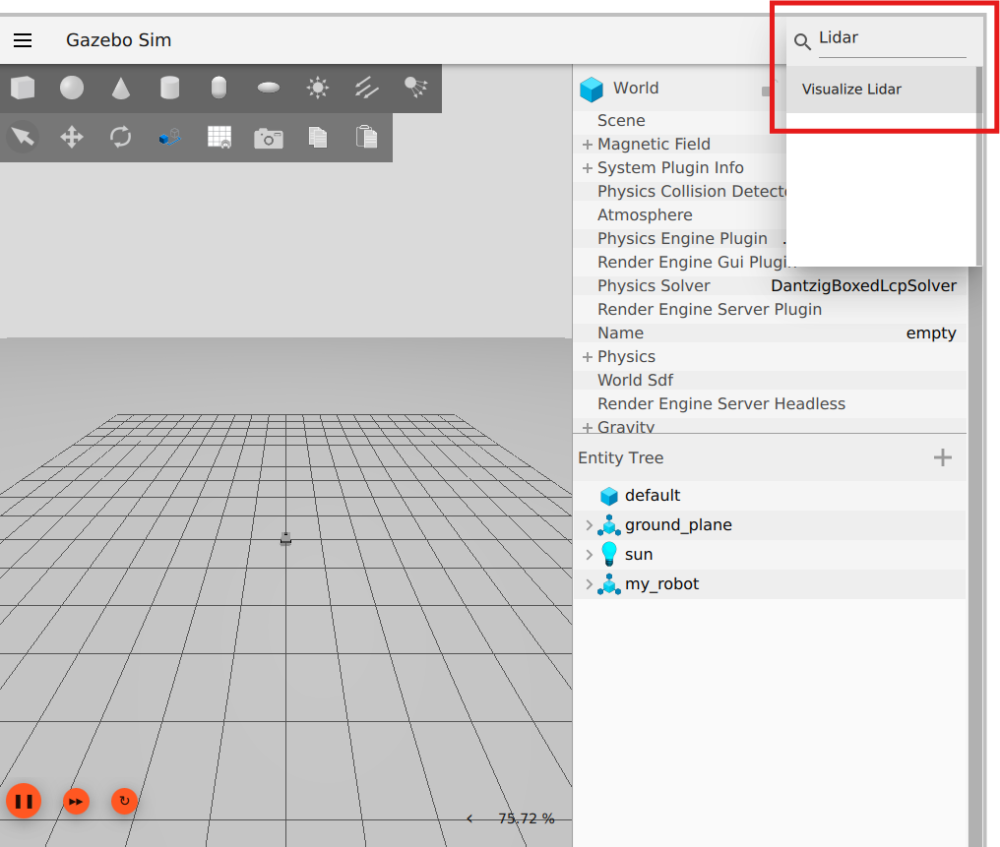

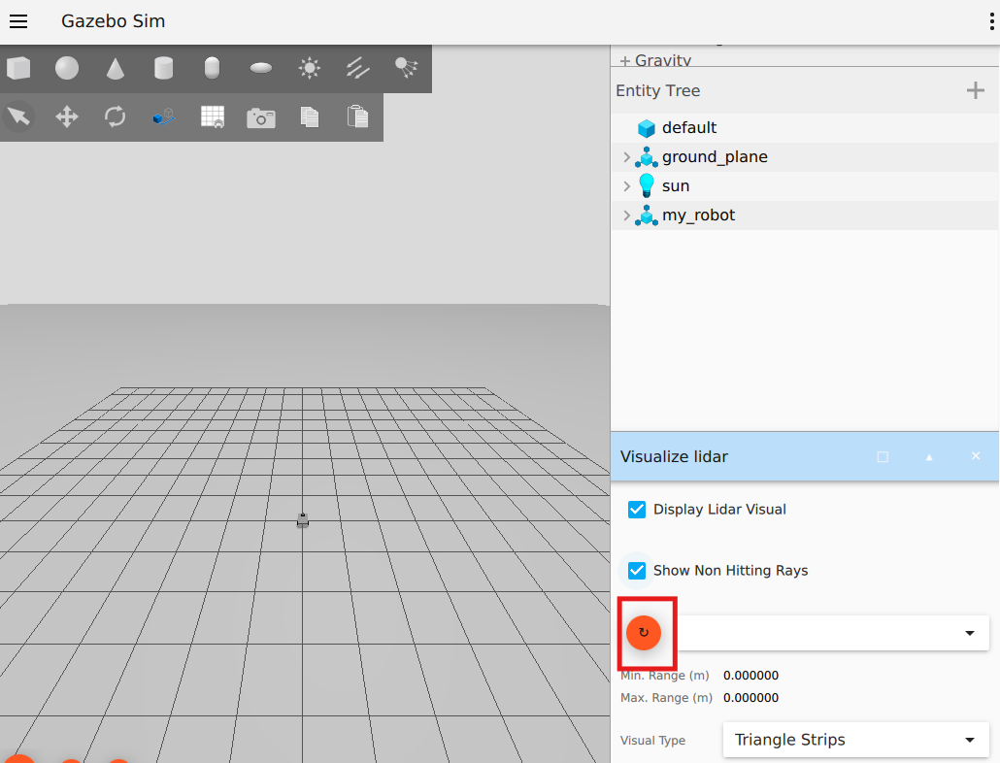
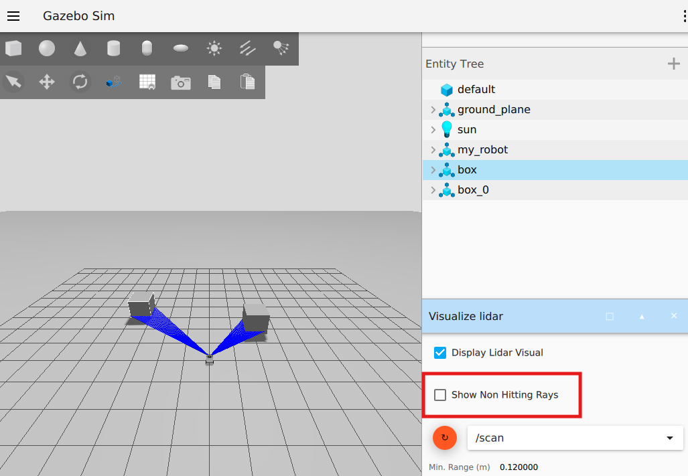

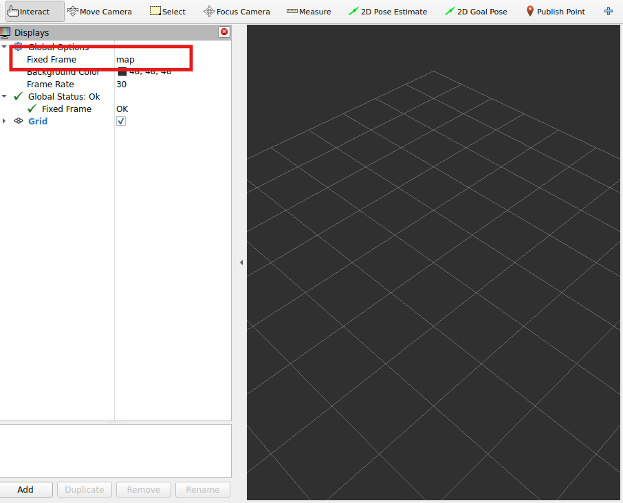
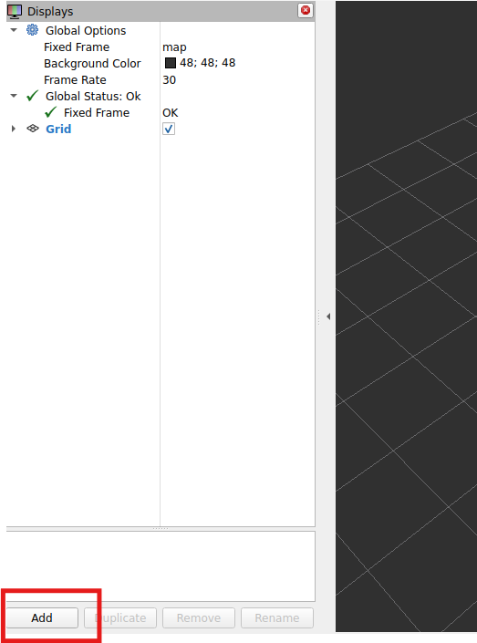

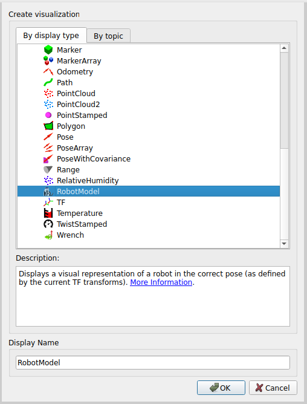

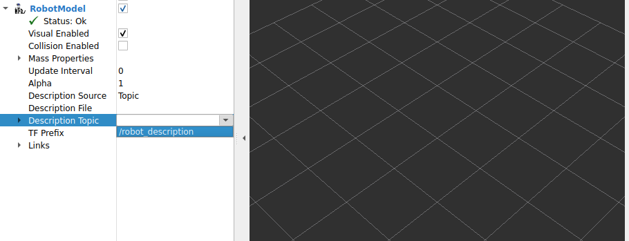

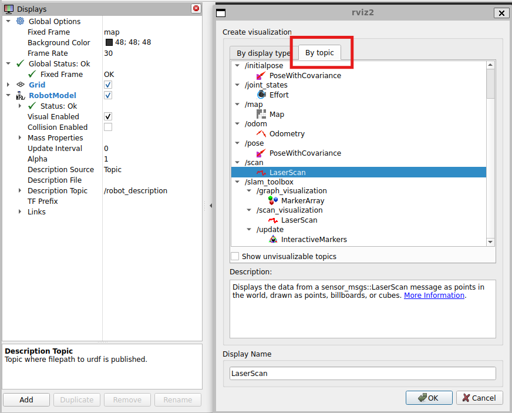


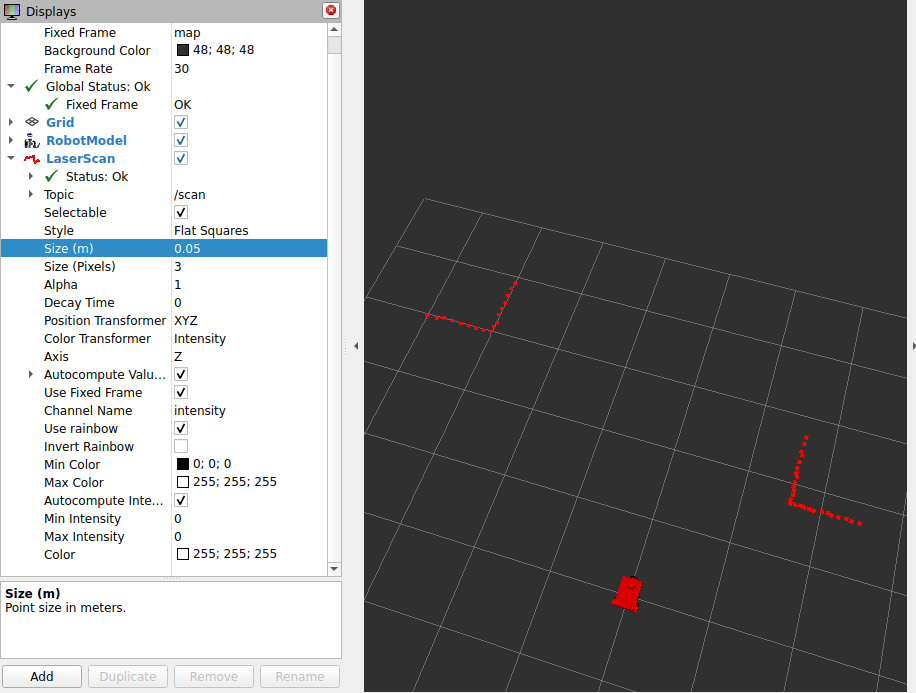


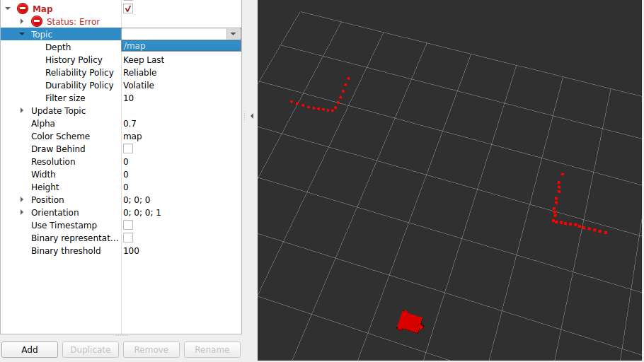

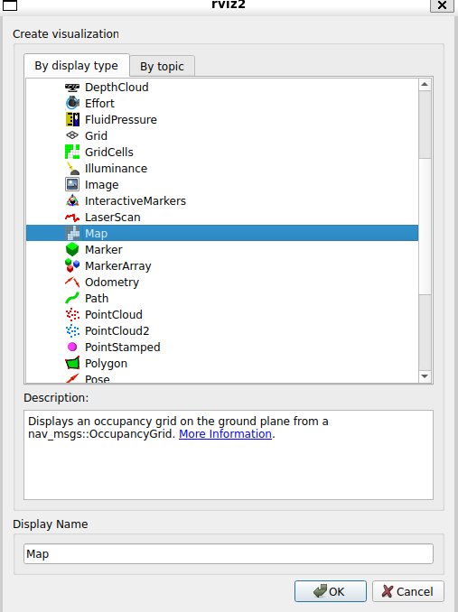

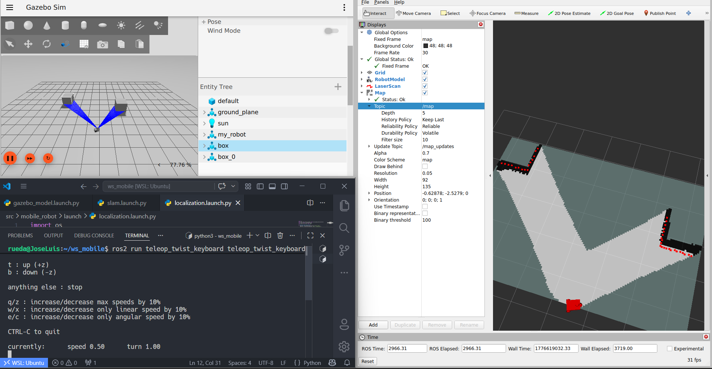
## RViz2
Asegúrate de que el Fixed Frame sea map

### Nota sobre RViz

El launch de SLAM referencia `src/mobile_robot/rviz/mi_configuracion.rviz`, pero ese archivo no está incluido actualmente en el repositorio. Si quieres usar el launch tal como está, debes crear ese perfil de RViz o ajustar el launch para que no lo cargue.

## Localización

Cuando ya tienes un mapa generado, puedes usar la localización con:

```bash
ros2 launch mobile_robot localization.launch.py
```

Ese launch carga:

- `maps/mi_mapa.yaml` en `map_server`;
- `parameters/amcl_params.yaml` en `amcl`;
- `nav2_lifecycle_manager` para activar ambos nodos.

## Mapa existente

El proyecto ya incluye un mapa base en:

- `src/mobile_robot/maps/mi_mapa.pgm`
- `src/mobile_robot/maps/mi_mapa.yaml`

Ese mapa puede usarse directamente para localización.

### Nota sobre Localización

Aun no esta completado la localización con amcl, aun esta es fase de pruebas y puede dar error al momento de hacer con el amcl

## Estructura breve

```text
src/mobile_robot/
├── launch/
├── maps/
├── model/
├── mobile_robot/
├── parameters/
├── resource/
└── test/
```

